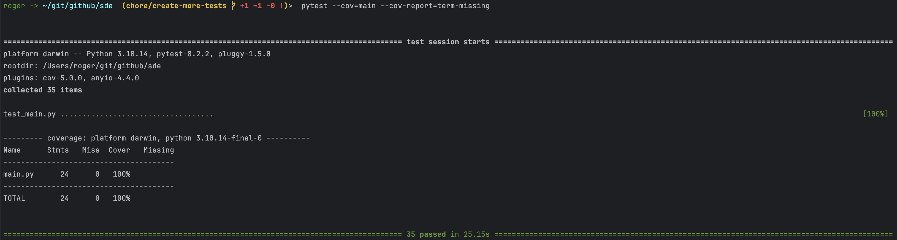
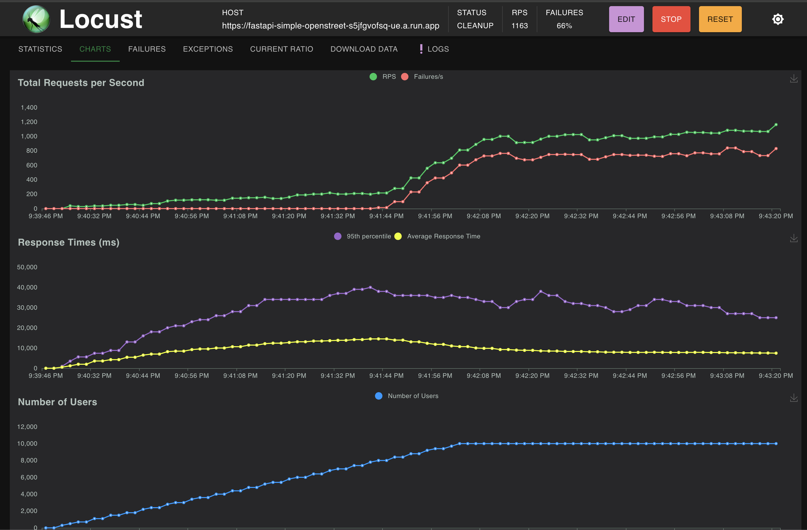
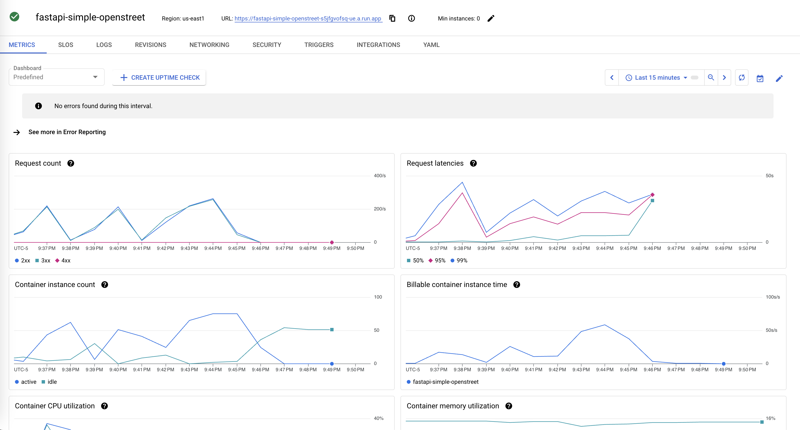
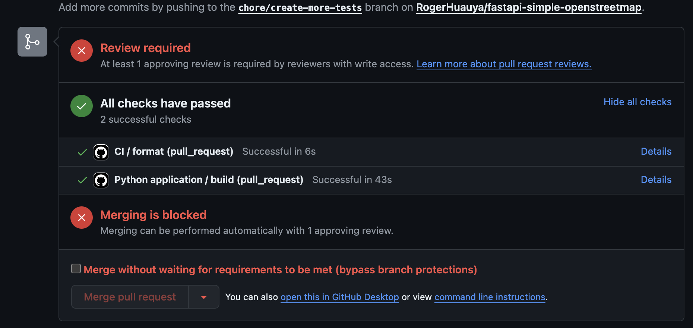

# Unit Tests and Test Driven Development API with FastAPI

## Overview
This simple FastAPI app is about using Unit Tests to apply the Test Driven Development (TDD) methodology to implement an API. The API exposes two endpoints:
1. `/coordinates`: Receives a city name and returns the latitude and longitude of the specified city or an error.
2. `/distance`: Receives two coordinates and returns the distance between them or an error.
## Public Repository
- **GitHub URL:** [https://github.com/RogerHuauya/fastapi-simple-openstreetmap](https://github.com/RogerHuauya/fastapi-simple-openstreetmap)
## Task Outline
1. Design the solution. ✅
2. Write unit tests to check structural aspects of the API. ✅
3. Implement the necessary code to pass the unit tests. ✅
4. Write a unit test to ensure endpoints return valid responses. ✅
5. Implement code to pass the new unit test. ✅
6. Write a unit test to check the correctness of the output for simple cases. ✅
7. Implement code to pass this unit test. ✅
8. Write a comprehensive unit test for various input cases. ✅
9. Implement code to pass the comprehensive unit test. ✅
10. Ensure code coverage is at least 98%. ✅
11. Perform stress tests and measure availability, latency, and code redundancy. ✅
12. Ensure maintainability with proper naming conventions, indentation, and explanatory comments. ✅
13. Generate project documentation. ✅
14. Design a Docker image for deploying the API. ✅
15. Add a `CODEOWNERS` file to the repository. ✅

## Implementation

### API Endpoints
The automated generated API documentation can be accessed at [https://fastapi-simple-openstreet-s5jfgvofsq-ue.a.run.app/docs](https://fastapi-simple-openstreet-s5jfgvofsq-ue.a.run.app/docs).
#### Get Coordinates
- **URL:** `/coordinates`
- **Method:** GET
- **Parameters:** `city_name` (string) - Name of the city.
- **Response:** JSON containing latitude and longitude or an error message.

#### Get Distance
- **URL:** `/distance`
- **Method:** GET
- **Parameters:**
    - `lat1` (float) - Latitude of the first coordinate.
    - `lon1` (float) - Longitude of the first coordinate.
    - `lat2` (float) - Latitude of the second coordinate.
    - `lon2` (float) - Longitude of the second coordinate.
- **Response:** JSON containing the distance between the coordinates or an error message.

### Unit Tests
- **Test Call Existing Endpoints:** Verify existing endpoints are callable.
- **Test Call Nonexistent Endpoints:** Verify non-existing endpoints return 404.
- **Test Endpoint Returns Something:** Ensure endpoints return valid responses.
- **Test Simple Cases:** Verify the correctness of outputs for specific input cases.
- **Test All Inputs:** Ensure outputs match expected values for various inputs.

### Docker Deployment
1. **DockerHub URL: [rogerhuauya/fastapi-simple-openstreetmap](https://hub.docker.com/repository/docker/rogerhuauya/fastapi-simple-openstreetmap/general)**

2. **Build and Push to DockerHub:**
    ```sh
    docker build -t rogerhuauya/fastapi-simple-openstreetmap .
    docker push rogerhuauya/fastapi-simple-openstreetmap
    ```

3. **Deploy on Google Cloud Run:**
    ```sh
    gcloud run deploy fastapi-simple-openstreet --port 80 --source .
    ```
    - **Service URL:** [https://fastapi-simple-openstreet-s5jfgvofsq-ue.a.run.app](https://fastapi-simple-openstreet-s5jfgvofsq-ue.a.run.app)

### CODEOWNERS File
```plaintext
* @rogerhuauya
```
## Evidences
### Unit Tests and Code Coverage
```sh
pytest --cov=main --cov-report=term-missing
```



### Stress Tests
```sh
locust -f locustfile.py
```

Cloud run metrics:


### Branch Protection and CI
Github actions setup for black and pytest. Branch protection enabled for main branch:

## Conclusion
This project demonstrates the application of TDD in developing a robust API with thorough unit tests, high code coverage, and proper deployment using Docker and Google Cloud Run. The inclusion of a CODEOWNERS file ensures code ownership and maintainability. ✅
